# natus_tests

Adding manual tests here. Those can be seen as examples though.

A real sample repo will be created later on.

Some tests allow to use the mouse and keyboard to move the camera.
- Right click and mouse move for camera rotation 
- WASDQR for camera translation

Please note that not all applications of this repository run on linux. The main development platform is still windows and once in a while I test this repository on a linux platform. It may be the case that this repository does not build on Linux. I just did not found the time to establish continuous integration for this project. I will work on that.

# The Tests 

## 00_empty
## 01_properties
## 02_profile
## 04_app
## 05_imgui
## 06_devices
Tests and shows how to use mouse and keyboard. Outputs device information.
## 07_gamepad
Tests and shows how to use a xbox controller by polling device events and displaying those in the console.
## 08_gamepad2
Tests and shows how to use the game controller device. The device is assigned a mapping of any known pluged in game pad and maps buttons in the background. 
## 09_gamepad3
Tests and shows how to use the game controller device and shows how to setup a user defined mapping to the game device.
## 10_database
Console application performs basic io database functionality tests by loading files and installing file monitors.
## 13_0_tasks
Console application performing async C++ lambdas. Break point application.
## 13_1_tasks
Tests and shows how to use the natus task graph in this simple console application.
## 13_2_thread_pool
Tests the engines thread pool class using tasks and sync objects. This app also prototypes a ```parallel_for``` kind of mechanism which requires some sort of ```yield``` operation.
## 13_3_parallel_for
Tests and shows how to use a ```parallel_for``` for computation intensive tasks on the CPU.
## 13_4_loose_scheduler
In contrast to the thread pool scheduler which distributes tasks across the threads in the pool which are limited, the loose scheduler immediately performs the tasks. This is useful if tasks need to wait for a uncertain amount of time which would block a thread pool thread.
## 14_import
## 15_import
## 16_nsl
## 17_nsl
## 18_nsl
## 19_0_audio_oal_capture
## 19_0_audio_wasapi_capture
## 19_0_audio_wasapi_capture_2
## 19_0_system_audio_capture
## 19_1_audio_oal_gen
## 19_2_audio_oal_capture_2
## 19_3_audio_capture
## 19_4_audio_async_capture
## 19_5_audio_gen_2
## 19_6_audio_play
Tests and shows how to play audio files in the engine. 

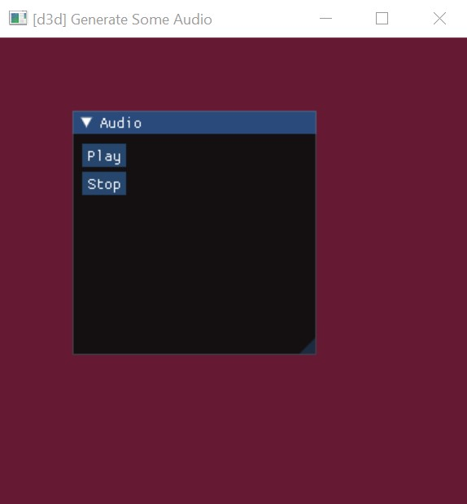
## 26_render_states
Tests and shows how to use render states. Render states management is somehow complex. The engine allows to push/pop render state sets which must enable/disable those render states and on popping those the old set need to be activated again.

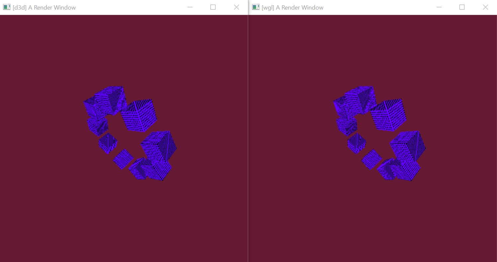

## 27_0_framebuffer_simple
Tests and shows MTR and framebuffer usage. Outputs two colors and allows to switch between the two render target outputs in post via the UI. Uses platform shaders only.

## 27_1_framebuffer_mrt
Tests and shows how to use MRT and the framebuffer object. Displays all output at the same time in post. Uses platform shaders.

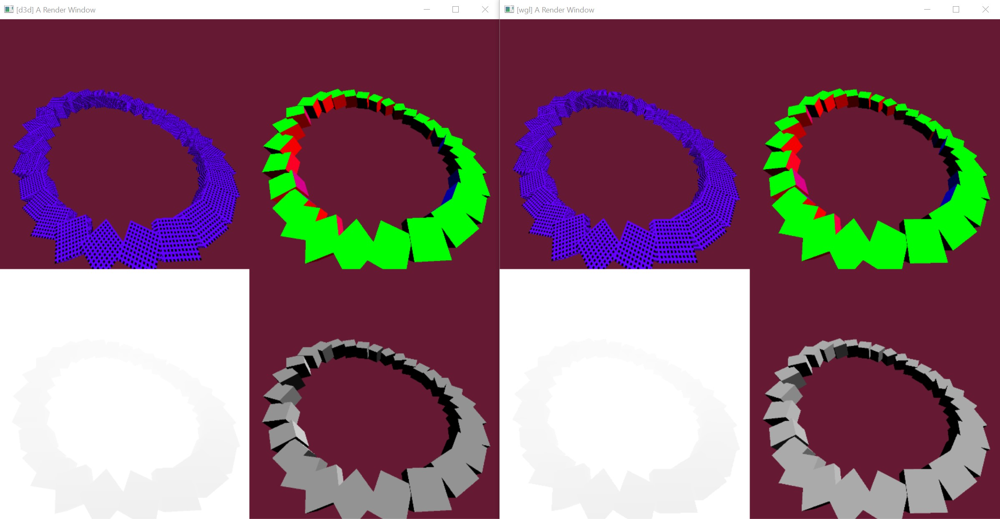

## 27_2_framebuffer_nsl
Does all the same as the previous test but uses an nsl shader. The test also shows how to display an output of the mrt framebuffer event in the tool UI.

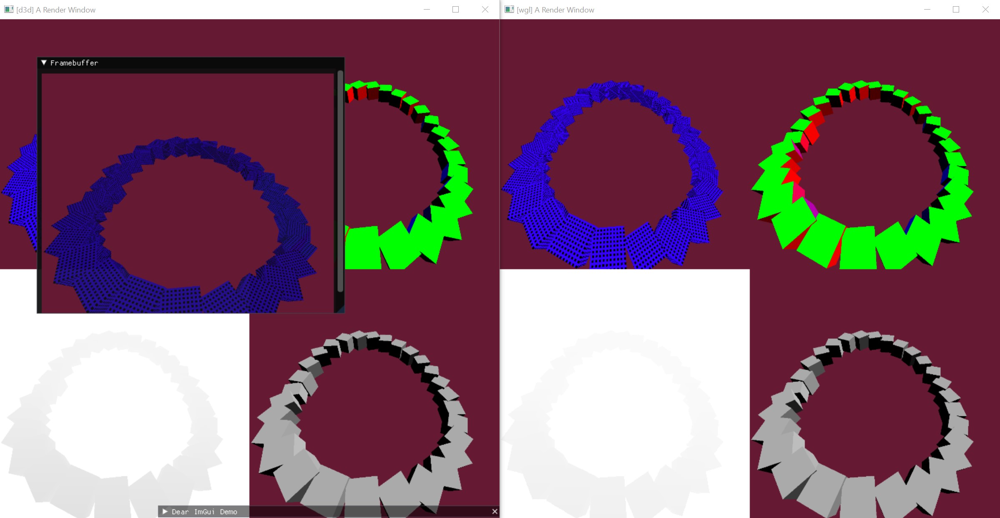

## 28_multi_geometry
Test and shows how to use multiple geometry objects in a single render configuration. The geometry can be changed via a render call using an index. Important to note here is that the geometry can be arbitrary, but the geometry layout of any added geometry to the render objects needs to be the same. The images shows the test application rendering tow different geometry objects with differend vertex attributes like vertex positions and vertex color but uses the same vertex layout which is important.

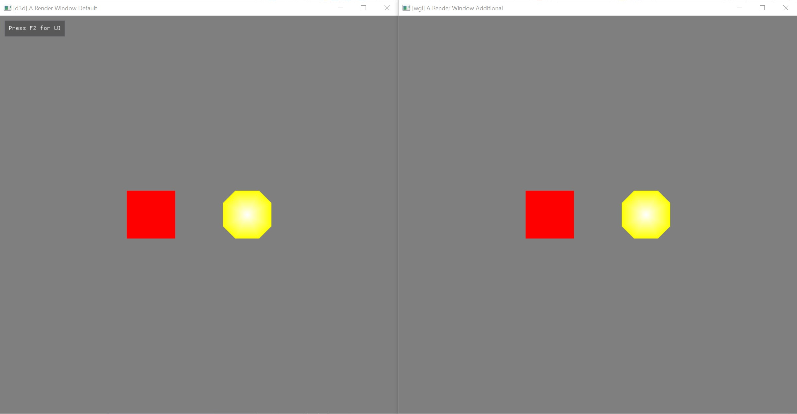

## 30_0_array_object
Tests and shows how to use an array object by doing the so called "vertex pulling" in the platform shader. Additional geometry data is pulled from an array buffer in the shader for further transformation. The shader pulls translation, rotation and color information from the array object. Array objects can be used to transfer alot of data to the GPU and decouple it from the geometry. So the geometry just needs to be present a few time or even only a single time but can be rendered many times by accessing the array object arbitrarilly in the shader.

## 30_1_array_object
Does the same as the last test but uses nsl only. The image shows the test application rendering many cubes with just one render call but accesses all the data within the shader. In this example, there is a one-to-one ratio of cubes and data per cube. It always is a trade off runtime cost versus memory cost. So this test uses more memory but only call the render function once. 

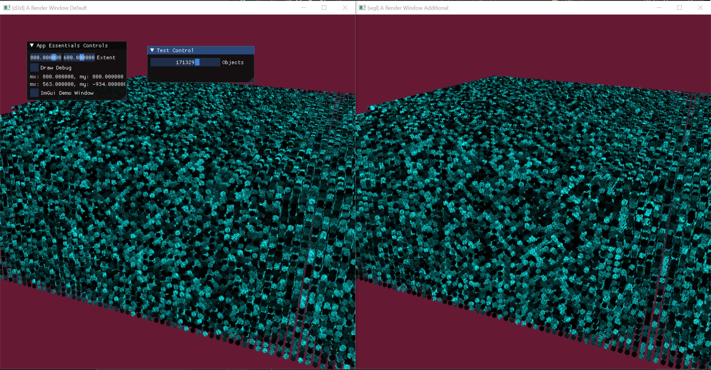

## 31_0_texture_array
Tests and shows how to use a texture buffer. The app loads four images and allows access in the shaders through a texture array. The shaders are implemented as platform shaders directly. 

## 31_1_texture_array
Does the same as the last test but with nsl only. The left quad shows all images in the texture array mapped to the quad and the right quad shows only one selected texture from the texture array using the ui slider.

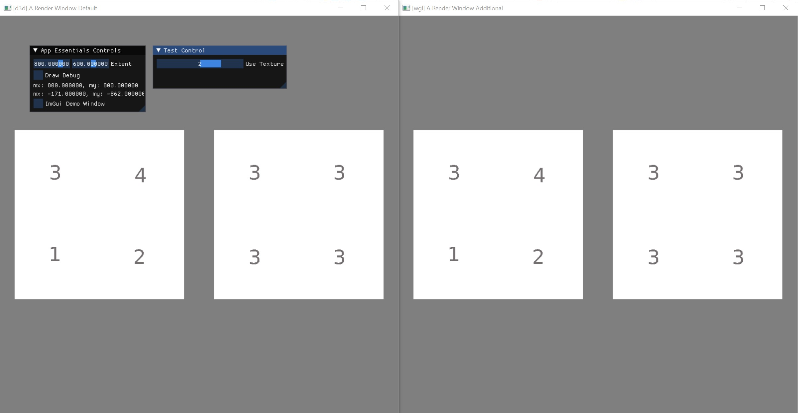

## 32_0_stream_out
Tests and shows how to use the streamout object in a GPU only simulation loop. This test does not use nsl shaders yet but platform shaders directy. The application uses the streamout object to transform geometry in a loop and afterwards binds it as a geometry object(vertex input data) for rendering. 

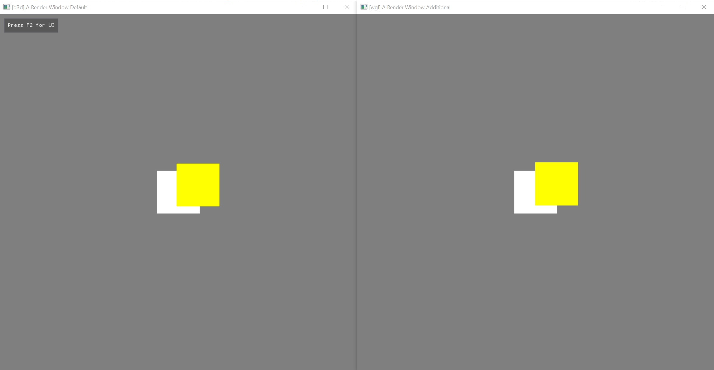

## 32_1_stream_out
This test performs a feedback loop using point primitives and binds the streamed out data to a data buffer object in the rendering shader which pulls the per vertex data from that data buffer which carries the streamout data.

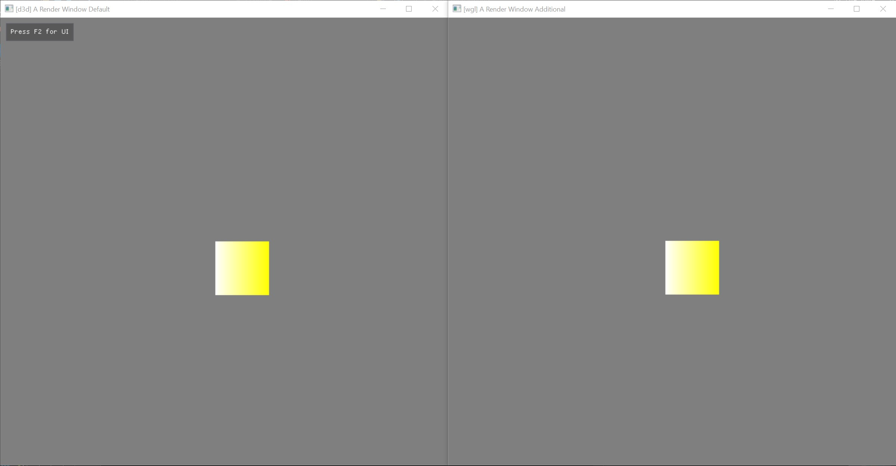

## 32_2_stream_out
Performs the same test as the previous test but uses nsl shaders. 

## 32_3_stream_out
Performs a streamout into a buffer object and feeds the data back to the particles vertex shader which performs a force integration in order to move the partilces. The only force applied is g(-9.81). The test uses nsl.

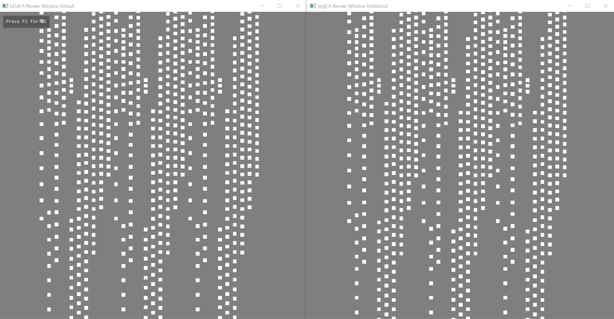

## 33_0_geometry_shader
Tests a simple pass through geometry shader using native shaders.

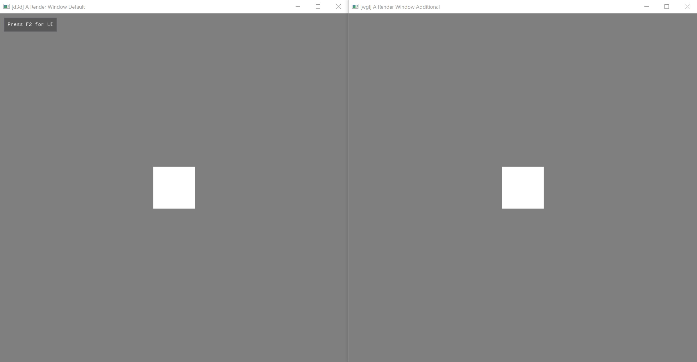

## 33_1_geometry_shader
nsl geometry shader test placeholder

## 34_0_reconfig
Tests and shows how to reconfigure rendering objects. In the engine every used rendering objects needs to be configured before it can be used. But it is also possible to re-configure the rendering object so data can change during runtime! This test allows to reconfigure the used image, geometry and shader. This allows to break point and step through this mechanism. The test uses nsl loaded from a file.

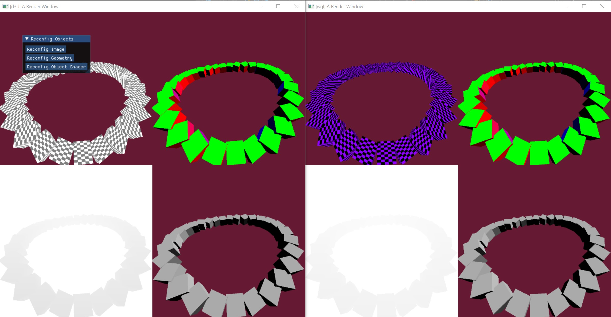

## 34_1_nsl_auto
Tests reconfiguration nsl as the last test but also tests and shows how to use a file monitor on the shaders. Changing the shaders in the files affects the application so that shaders are reloaded in the engine. Every user interaction is put into tasks and is performed asynchronously.

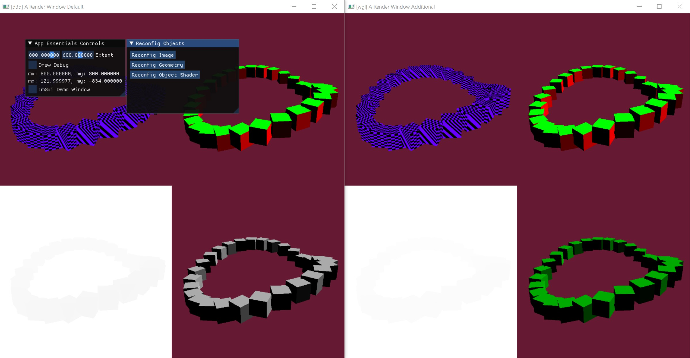

## 34_2_nsl_auto
Does exactly the same as the previous test but uses the ```app_essentials``` for file monitoring and refreshing the shaders.

## 37_0_glyph_atlas
Tests the glyph atlas creation algorithm and the proper importing of glyphs. Allows to break point the app for debugging. The glyph atlas is created based on user provided .ttf or .otf files. The atlas is actually created during importing the fonts in the specific import module.

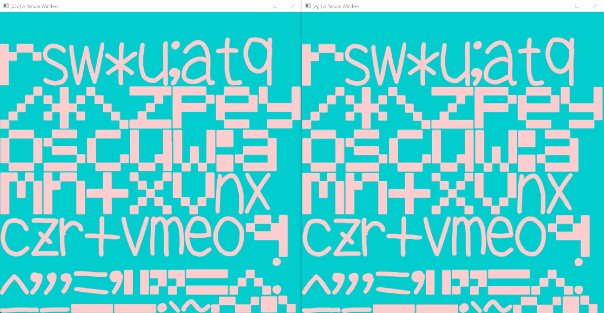

## 37_1_text_render_2d
Tests and shows how to use the ```text_render_2d``` class. The test simply draws some lines in different sizes and outputs a counter updated continuously.

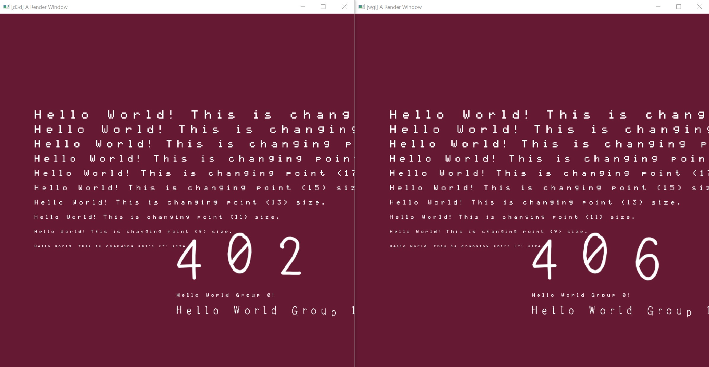

## 37_2_primitive_render_2d
Totally simple breakpoint test case checking the ```primitive_render_2d``` class.

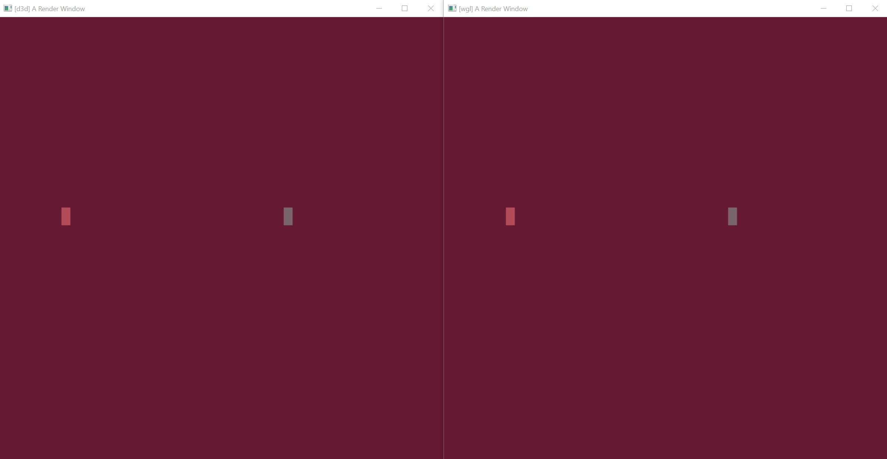

## 37_3_primitive_render_2d
Tests and shows how to use the ```primitive_render_2d``` class drawing more geometry. This type of renderer is supposed to be used as a debugging tool discovering rendering issues or just helping in tool/debug visualization.

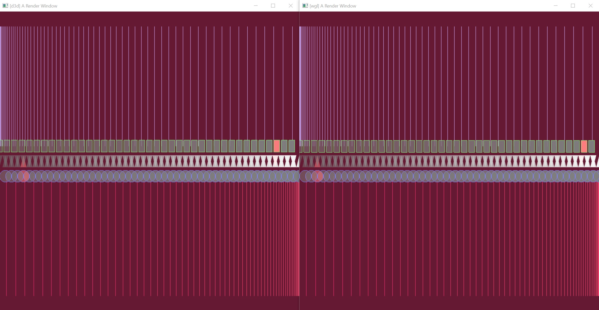

## 38_0_sprite_render_2d
Simple ```sprite_render_2d```test just allowing to set and debug by break points.

## 38_1_sprite_sheet
Self running test for placing breakpoints for debugging.

## 38_2_sprite_sheet
Tests and shows how to load a sprite sheet and setting up the render for it. This gives the ```sprite_render_2d``` a first test run.

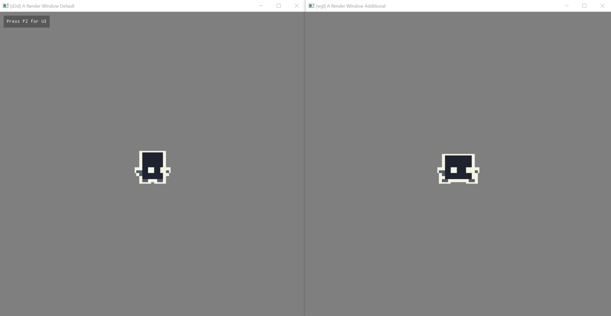

## 38_3_sprite_sheet
Does the same as the previous test but also moves the sprites.

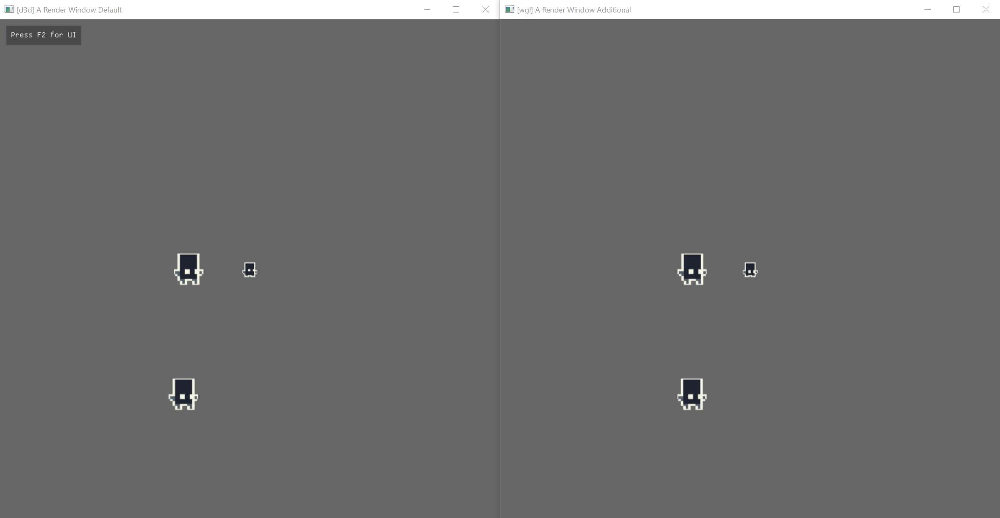

## 41_0_particle_system
First implmentation of an particle system. See next test for more detail. 
This test may go away in the future.

## 41_1_particle_system
Tests the use of particles in the engine and uses the primitive renderer for simple visualization. The UI allows to change some parameters of the particle system.


## 43_inv_space_2d
This was a curious endeavour into infinite space by developing a custom coordinate system. The coordinate system divides all space into regions and indexes those rough regions by a ```size_t``` type in 2d. Each of those regions is further divided which is referenced by a 2d ```float``` coordinate. Essentially the test showed those custom coordinates needed to be dragged throughout the whole system/engine by even implementing all math using those coordinates. I think it would be simpler to just use ```double``` floating point types instead.
The image shows region division by the blue lines and sub/floating point division using the green line. So every blue box has its own whole 32 bit floating point space.

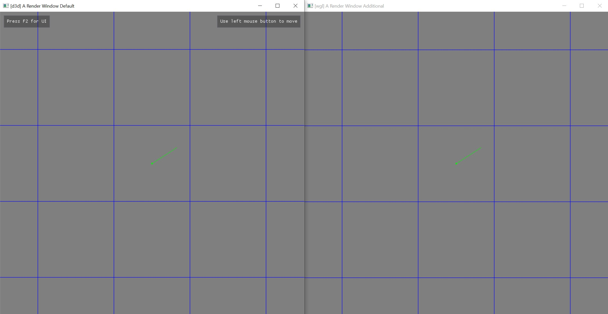

## 44_0_world_2d
Shows how to render a huge world grid. Allows translation through the world by keyboard usage. The world is split into regions which are further devided into smaller cells. Each cell or region could contain data. This test is more an endeavour into towards game development.

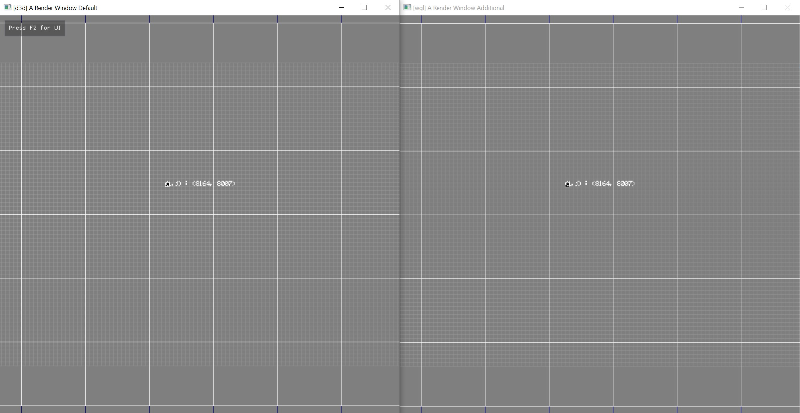

## 44_1_world_2d
Does the same as the previous test but draws cells according to some implicit function into the world.

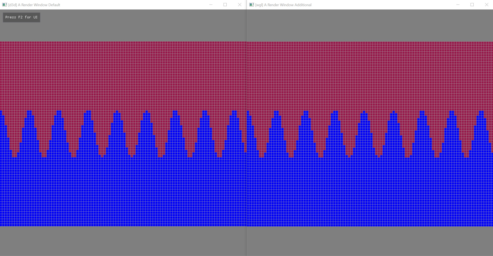

## 45_0_line_3d
Tests and shows how to use the line renderer 3d. It simply draws some lines in 3d space.

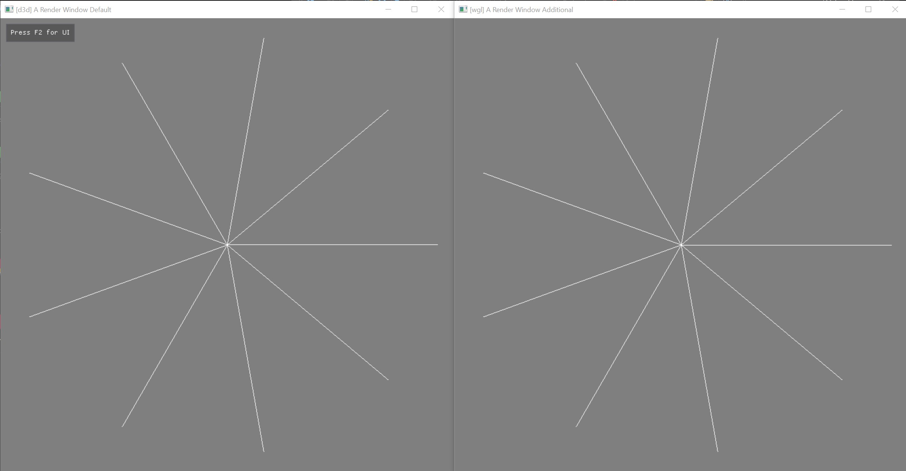

## 46_0_spline
This is a simple console test application checking the engines' splines functionality. It also shows how to use splines basically.

## 46_1_spline
Tests and shows how to use and render splines in the engine. The test application simply draws the spline using the line renderer.

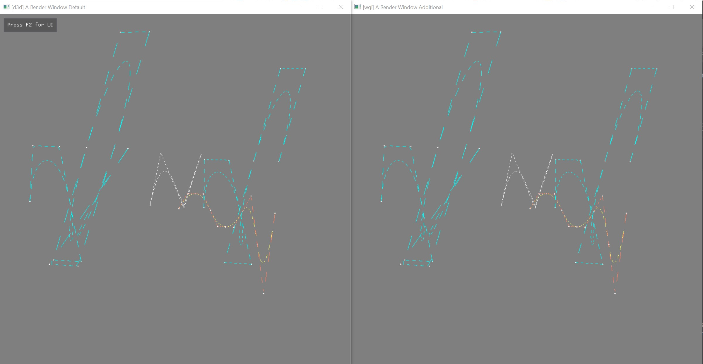

## 46_2_spline
Tests and shows how to use and render splines in a simple way using the line renderer. Additionally its performs changine splines at runtime by changing control points. 

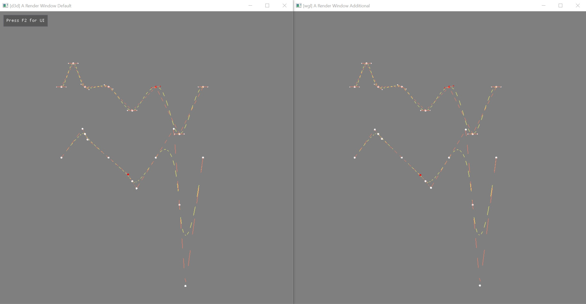

## 47_0_keyframe
Tests ands shows keyframe functionlity in a simple console application.

## 47_1_keyframe
Tests and shows how to use keyframes and use it for altering position and color or renderable objects.

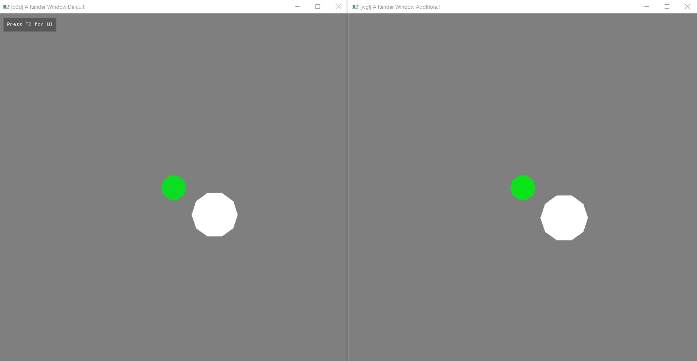

## 48_pinhole_camera
Tests and shows how to use a pinhole camera. 

## 49_picking_2d
Tests and shows how to pick objects in 3d space using natus. The mouse was hovered over the red circle in the window but the mouse cursor was not captured, instread the black arrow marks the hovered circle.

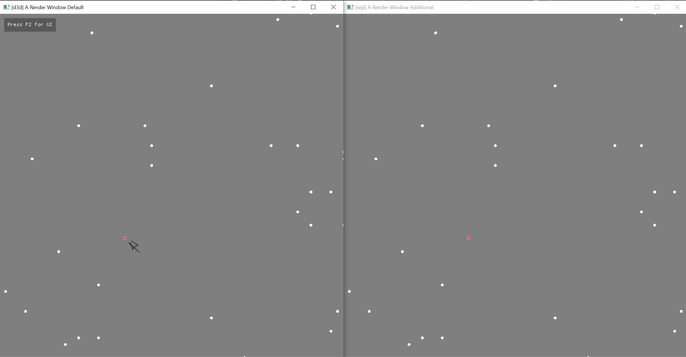

## 50_simple_essentials
Tests and shows how to use the very usefull ```app_essentials```class. It provides many essentials like mouse, keyboard, basic camera, basic camera movement, basic UI elements, shader file loading/monitoring/reloading and much more.

## 51_0_post_process
Tests and shows how to use post processing using nsl. The shaders are contained and loaded from within the code. The test renders a few rotating cubes and performs a post process using a framebuffer and an post processing shader that performs some color correction.

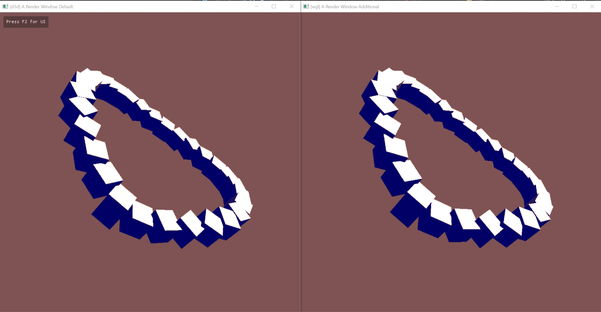

## 51_1_post_process
Does the same as the last test but also performs a box blur filter in the post shader.


## 51_2_post_process
Does the same as the last test but also lets the user choose a post processing shader from a list in the ui. This time, the shaders are imported and loaded from a file. When the shader is loaded into the engine, it is completely newly compiled and provided to the run-time, so shaders can be changed during run-time. The changed shader is loaded automatically if the changed file is saved on the disc. No user interaction required.

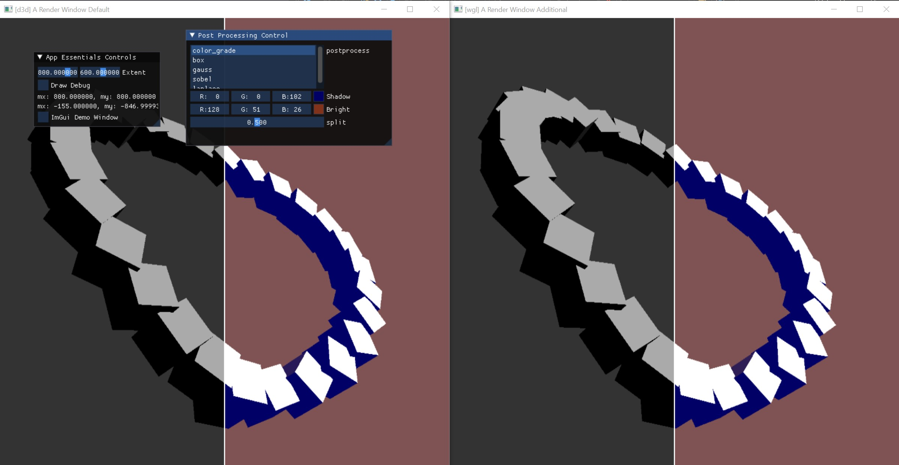

## 51_3_post_process_fxaa
Not properly working and is work in progress.

## 52_time_measure
Placeholder

## xx_tool_player_timeline
Tests, prototypes and shows how to use the timeline UI widget along with the player widget. Those UI elements could be used for any sort of animation timing.

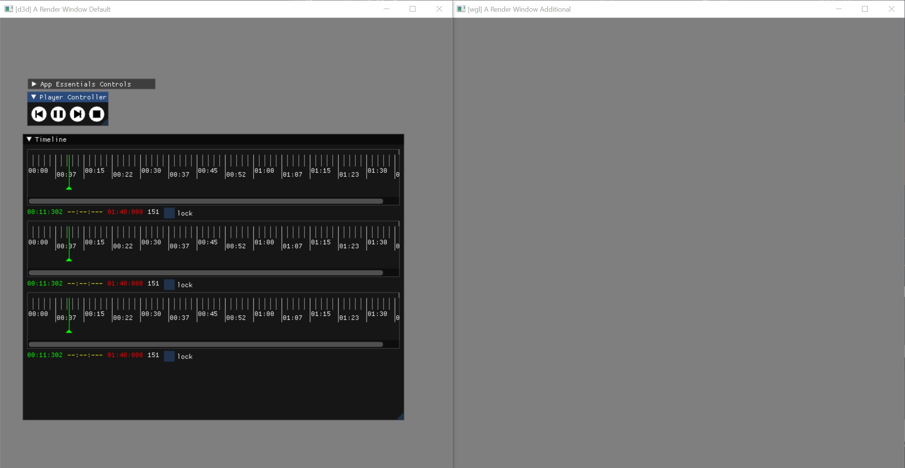

## xx_tool_sprite
Tests, prototypes and shows how to use the sprite editor. It loads and stores sprite information within a natus own sprite sheet file format. The tools allows to set various bounds for animation, collision, damage and allows to specify linear animation sequences. The source is a sprite sheets that can be accossiated with sprite file.
I wanted to make a few games with this tool but still working on the engine X)


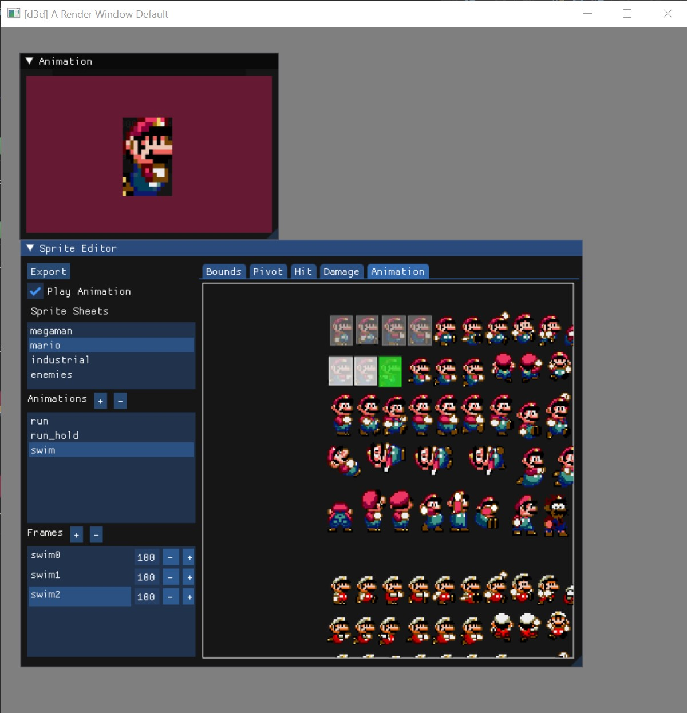
