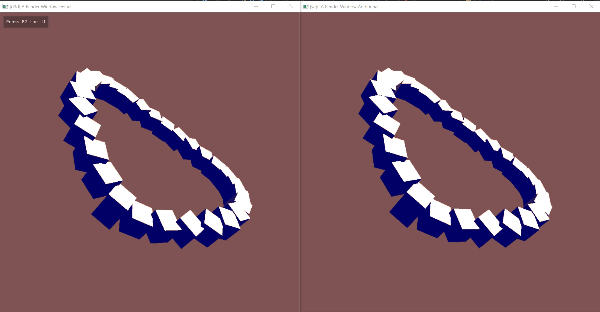
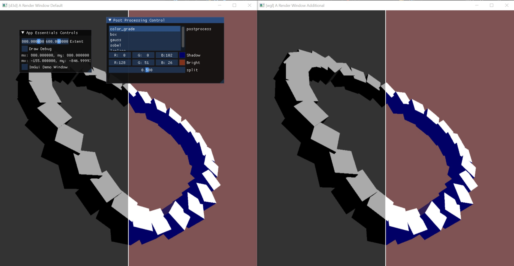

# The Graphics Suite

## 51_0_post_process
Tests and shows how to use post processing using nsl. The shaders are contained and loaded from within the code. The test renders a few rotating cubes and performs a post process using a framebuffer and an post processing shader that performs some color correction.

## 51_1_post_process
Does the same as the last test but also performs a box blur filter in the post shader.

## 51_2_post_process
Does the same as the last test but also lets the user choose a post processing shader from a list in the ui. This time, the shaders are imported and loaded from a file. When the shader is loaded into the engine, it is completely newly compiled and provided to the run-time, so shaders can be changed during run-time. The changed shader is loaded automatically if the changed file is saved on the disc. No user interaction required.

## 51_3_post_process_fxaa
Not properly working and is work in progress.
