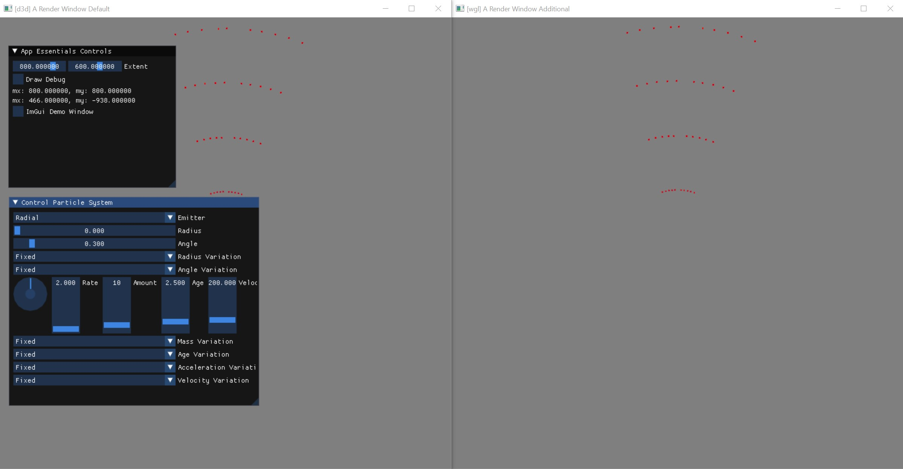

# The Physics Suite

## 0_0_particle_system
First implmentation of an particle system. See next test for more detail. 
This test may go away in the future.

## 0_1_particle_system
Tests the use of particles in the engine and uses the primitive renderer for simple visualization. The UI allows to change some parameters of the particle system.

