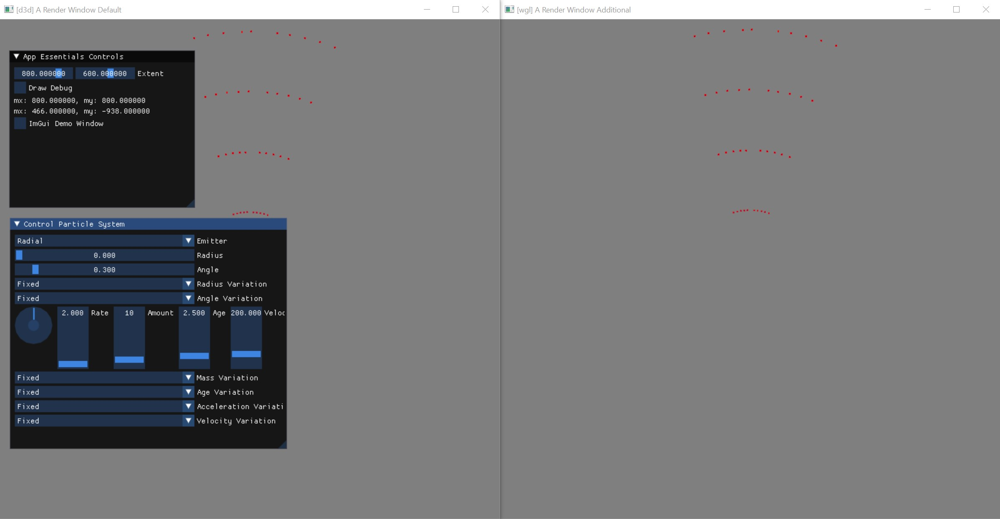
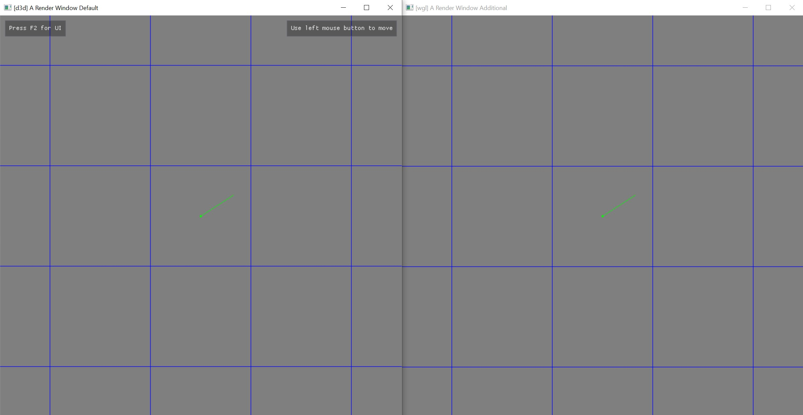
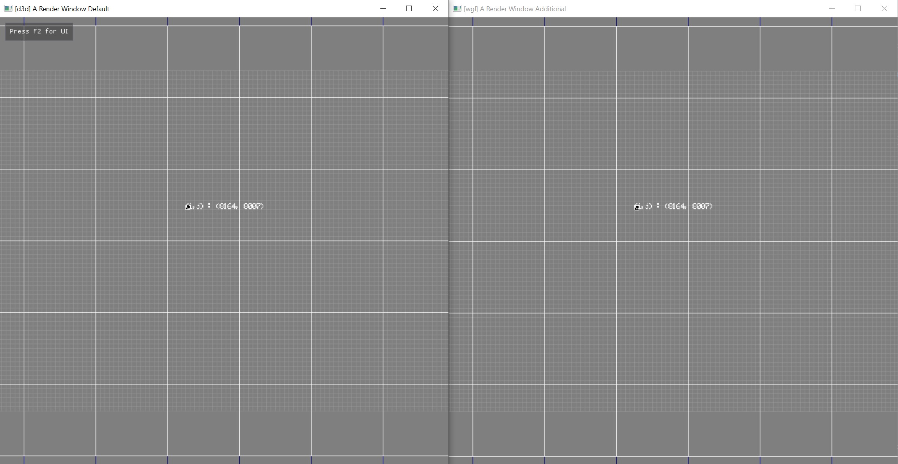
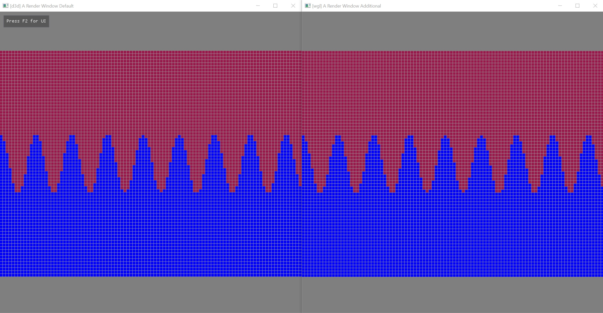
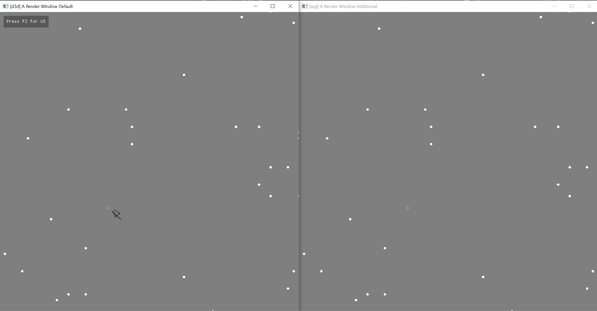
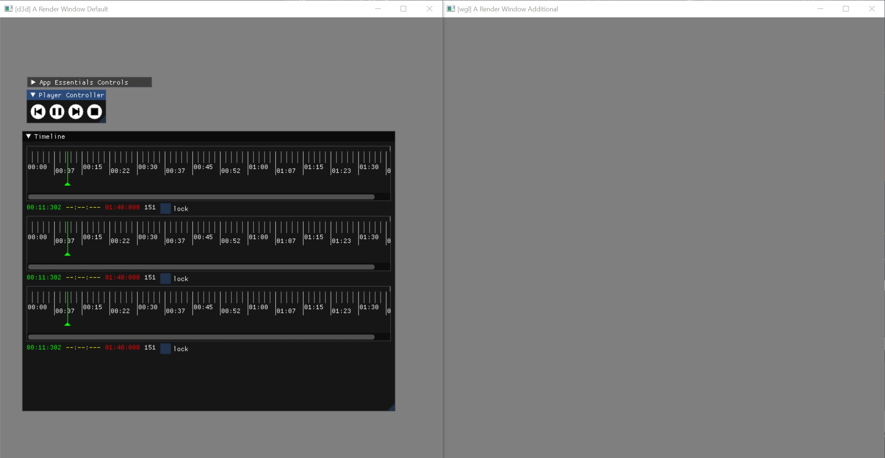
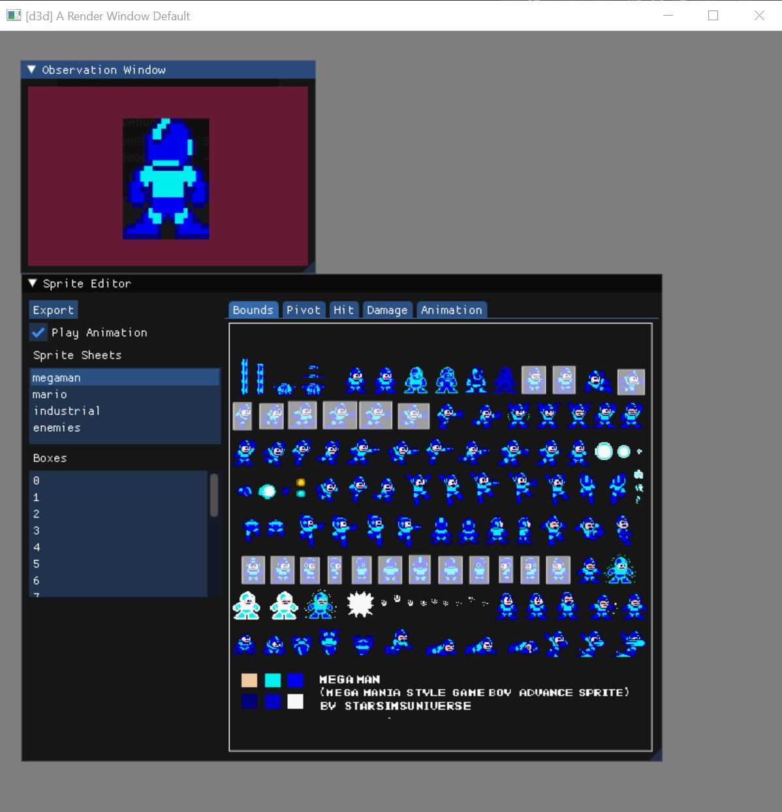
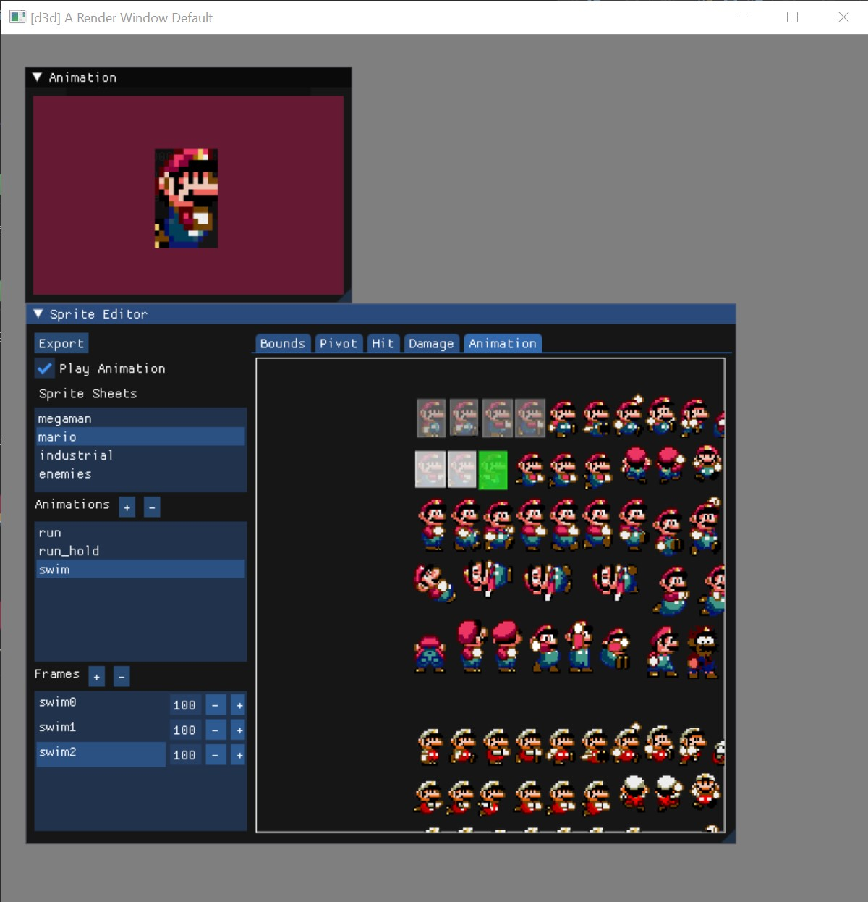

# The Prototyping Suite

## xx_1_tile_render
## xx_2_tile_render
Rendering each world tile into a framebuffer. This project revealed the shortcoming that the primitive renderers can not split rendering across framebuffers. 

## 41_0_particle_system
First implmentation of an particle system. See next test for more detail. 
This test may go away in the future.

## 41_1_particle_system
Tests the use of particles in the engine and uses the primitive renderer for simple visualization. The UI allows to change some parameters of the particle system.



## 43_inv_space_2d
This was a curious endeavour into infinite space by developing a custom coordinate system. The coordinate system divides all space into regions and indexes those rough regions by a ```size_t``` type in 2d. Each of those regions is further divided which is referenced by a 2d ```float``` coordinate. Essentially the test showed those custom coordinates needed to be dragged throughout the whole system/engine by even implementing all math using those coordinates. I think it would be simpler to just use ```double``` floating point types instead.
The image shows region division by the blue lines and sub/floating point division using the green line. So every blue box has its own whole 32 bit floating point space.



## 44_0_world_2d
Shows how to render a huge world grid. Allows translation through the world by keyboard usage. The world is split into regions which are further devided into smaller cells. Each cell or region could contain data. This test is more an endeavour into towards game development.



## 44_1_world_2d
Does the same as the previous test but draws cells according to some implicit function into the world.



## 49_picking_2d
Tests and shows how to pick objects in 3d space using natus. The mouse was hovered over the red circle in the window but the mouse cursor was not captured, instread the black arrow marks the hovered circle.



## xx_tool_player_timeline
Tests, prototypes and shows how to use the timeline UI widget along with the player widget. Those UI elements could be used for any sort of animation timing.



## xx_tool_sprite
Tests, prototypes and shows how to use the sprite editor. It loads and stores sprite information within a natus own sprite sheet file format. The tools allows to set various bounds for animation, collision, damage and allows to specify linear animation sequences. The source is a sprite sheets that can be accossiated with sprite file.
I wanted to make a few games with this tool but still working on the engine X)



